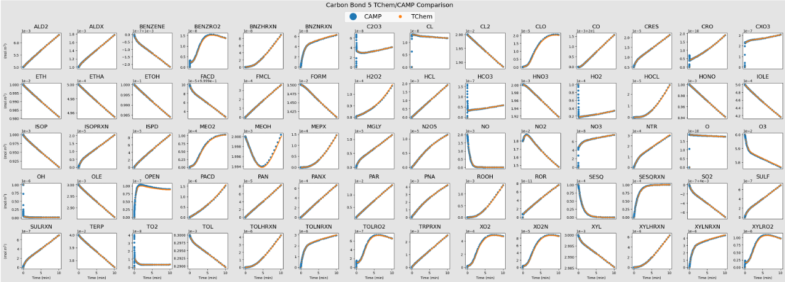

# **Carbon Bond 05 Chemical System**

We adapted the Carbon Bond 05 reaction mechanism from the [CAMP chemistry code](https://github.com/open-atmos/camp/tree/main/mechanisms/cb05cl_ae5).

Mechanism details:

* Number of Species: 67
* Number of Reactions: 187
* Arrhenius type reactions: 168
* CMAQ_H2O2 type reactions : 3
* Troe type reactions: 16
* Sources e.g., EMISSION: 14

This mechanism, used for testing the CAMP solver, contains 26 photolysis reactions, which we replace with Arrhenius-type reactions that have energy = 0 and temperature coefficient = 1.

Scripts to run and plot the outputs of this example are at: `src/examples/runs/atmospheric_chemistry/CB05CL_AE5`. The bash script to run this mechanism is shown below:

```bash
exec=$TCHEM_INSTALL_PATH/examples/TChem_AtmosphericChemistry.x

run_this="$exec --chemfile=config_full_gas.yaml \
                --outputfile=full_gas.dat \
                --time-iterations-per-interval=10 \
                --tol-time=1e-10 \
                --dtmin=1e-20 \
                --dtmax=10 \
                --tend=600\
                --atol-newton=1e-18 \
                --rtol-newton=1e-8 \
                --max-newton-iterations=20 \
                --max-time-iterations=20000"

echo $run_this
eval $run_this
```

Here, the `TChem_AtmosphericChemistry.x` executable is a box model that integrates (in time) a list of species using the mechanism file from the input "`chemfile`", which in this case is `config_full_gas.yaml`.
The system is a box model or zero-dimensional system that only considers chemical reactions.
The executable saves the time profiles for the species in `outputfile=full_gas.dat`.
In the example directory, the Jupyter-notebook `PlotFullGas` plots the time profiles of each species from the TChem-atm simulation and compares to CAMP's outputs.
Note that the CAMP output was previously computed and is saved in the TChem-atm repository.

When running the `TChem_AtmosphericChemistry.x` executable, the user may change time integration parameters of the [TrBDF2 solver](https://github.com/sandialabs/Tines?tab=readme-ov-file#timeintegration).
First, the Newton solver parameters are the absolute (`atol-newton`) and relative tolerance (`rtol-newton`) and the maximum number of iterations (`max-newton-iterations`).
Second, the time step size is controlled using the `tol-time` parameter and the maximum (`dtmax`) and minimum (`dtmin`) time step values.
Third, one of the parameters `tend` or `max-time-iterations` will determine end the simulation.
Finally, one can find additional help information from the `TChem_AtmosphericChemistry.x` executable using `TChem_AtmosphericChemistry.x --help`.



Comparing TChem-atm and CAMP outputs for the Carbon Bond 05 mechanism.
