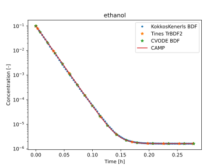
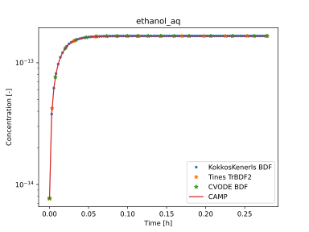

# **SIMPOL mass transfer**

Scripts to run and plot the outputs of this example are located at: `$TCHEM_INSTALL_PATH/examples/runs/atmospheric_chemistry/Simpol`. The bash script to run this case is shown below:

```bash
exec=$TCHEM_INSTALL_PATH/examples/TChem_AerosolChemistry.x

run_this="$exec --chemfile=config_gas.yaml \
	            --aerofile=test_SIMPOL_phase_transfer.yaml \
                --inputfile_particles=scenario_conditions_particle.yaml \
	            --outputfile=full_gas.dat \
	            --time-iterations-per-interval=10 \
                --max-time-iterations=100\
	            --tol-time=1e-3 \
          		--atol-time=1e-12 \
	  			--dtmin=1e-20 \
          		--dtmax=10\
          		--tend=1000 \
          		--atol-newton=1e-12 \
          		--rtol-newton=1e-8 \
          		--max-newton-iterations=20 \
          		--max-time-iterations=200000"

echo $run_this
eval $run_this
``` 
Here, the `TChem_AerosolChemistry.x` executable is a box model that integrates (in time) a list of species using the mechanism file specified in the `chemfile` and aerosol species specified in the `aerofile`.

TChem-atm provides executables for CVODE, `$TCHEM_INSTALL_PATH/examples/TChem_AerosolChemistry_CVODE.x`, and Kokkos-Kernels, $`TCHEM_INSTALL_PATH/examples/TChem_AerosolChemistry_KokkosKernels.x`.

The time profiles for ethanol and its aqueous solution are depicted in the figures below. These profiles were generated using TChem-atm, employing ODE solvers such as Tines, Kokkos-kernels (BDF), and Sundials (CVODE). For the purpose of code-to-code verification, we additionally showcase profiles derived from CAMP.




