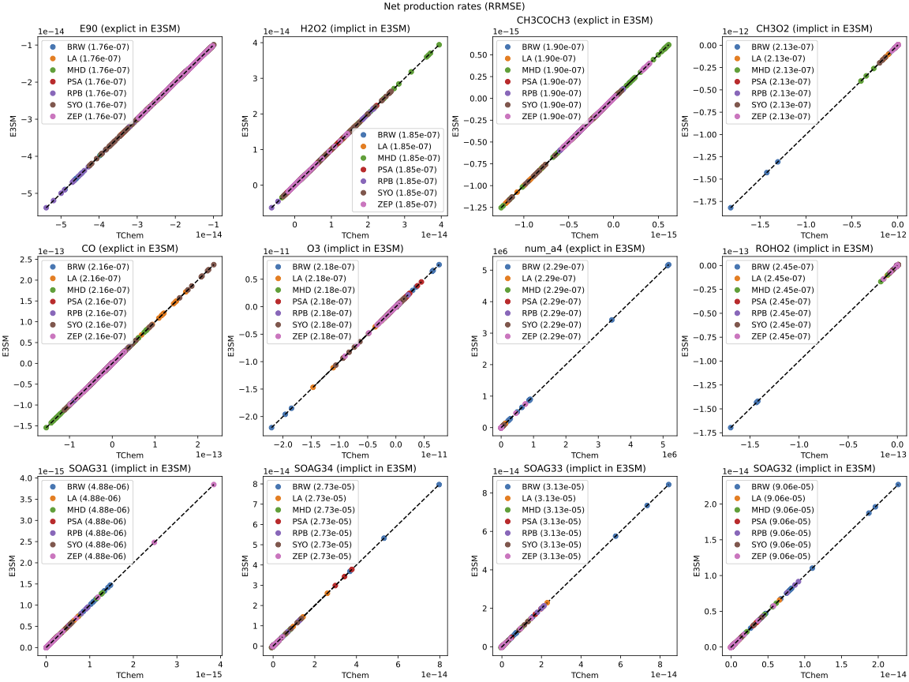
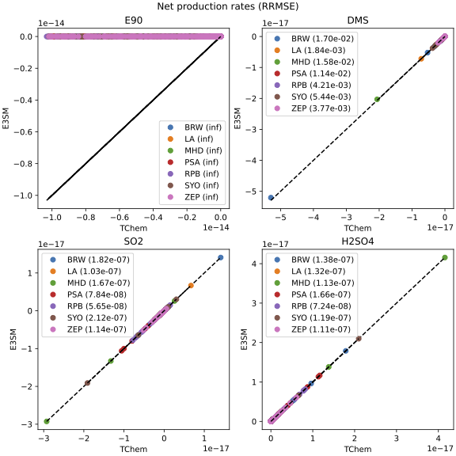

# **UCI mechanism - E3SM Version 3 Chemistry**

E3SM version 3 uses the UCI mechanism to model gas chemistry employing separate reaction mechanisms for the Troposphere and Stratosphere. As part of the Sandia LDRD project "Benchmarking TChem for Potential Incorporation into E3SM as a Replacement Chemical Kinetics Solver", we created TChem-atm input files for the UCI mechanism. In addition, we implemented reaction types that are needed to solve this chemistry mechanism in TChem-atm.

E3SM currently employs the Community Atmospheric Model Pre-Processor (CAMPP) to generate a set of Fortran files that represent and solve the chemical kinetic model, which includes reaction coefficients, the right-hand side of volumetric mixing ratio (vmr, denoted $\eta$), and ODE solvers (Implicit/Explicit solver). Ultimately, CAMPP aims to compute an updated vmr ($\eta_{t+\Delta t}$) for the troposphere and stratosphere.

For additional information on this LDRD project, we recommend reading the [SAND2024-01807R report](/../sand_report/QTI_tchemV1.pdf). As described in the report, we employed TChem-atm to advance the system one-time step and compared these outputs with those from E3SM in six different locations (see table below).
To verify the performance and implementation of TChem-atm, we consider the relative root mean square error (RRMSE) of the difference between the E3SM and TChem-atm outputs.

| Abbreviation | Latitude | Longitude | Location |
|--------------|----------|-----------|----------|
| LA | 34.0549 | -118.2426 | Los Angeles, CA, USA |
| BRW | 71.323 | -156.6114 | North Slope, AK, USA |
| MHD | 53.326 | -9.899 | Halfmace, County Galway, Ireland |
| PSA | -64.7742 | -64.0527 | Palmer Station, Antarctica |
| RPB | 13.165 | -59.432 | Ragged Point, Barbados |
| SYO | -69.0125 | 39.59 | Showa Station, Antarctica |
| ZEP | 78.9067 | 11.8883 | Zeppelin mountain, Ny-Ålesund, Norway |


### **Troposphere Mechanism**

The bash scripts and input files for UCI chemistry in the troposphere are located at `src/examples/runs/uci_col`. In this directory, we split the input file of TChem-atm into two files. One contains initial conditions, and the other file lists reactions, constant species, and active species. The chemistry file for the UCI mechanism is located at `src/examples/runs/uci_col/uci_v2_test3.yaml`. The initial conditions file for one of the UCI tests is located at `src/examples/runs/uci_col/input_conditions_col.yaml`, and corresponds to a set of cells for one location in an E3SM simulation.

Mechanism details:

* Number of species: 82
* Number of invariants or constant species: 29
* Number of reactions: 106
* Number of Arrhenius-type reactions: 71
* Number of JPL-Troe type reactions: 10
* Number of Ratio JPL-Arrhenius type reactions : 3
* Number of Photolysis rates: 22

An example run script for the UCI mechanism is presented below:

```bash
exec=$TCHEM_INSTALL_PATH/examples/TChem_AtmosphericChemistryE3SM.implicit_euler.x
input=$TCHEM_INSTALL_PATH/examples/runs/atmospheric_chemistry/uci_col/uci_v2_test3.yaml
inputFile=$TCHEM_INSTALL_PATH/examples/runs/atmospheric_chemistry/uci_col/input_conditions_multi_col.yaml

run_this="$exec --chemfile=$input \
                --inputfile=$inputFile \
                --outputfile=full_gas.dat \
                --time-iterations-per-interval=100 \
                --tol-time=1e-6 \
                --dtmin=1800 \
                --dtmax=1800 \
                --tend=1800 \
                --atol-newton=1e-18 \
                --rtol-newton=1e-8 \
                --max-newton-iterations=20 \
                --max-time-iterations=20000"

echo $run_this
eval $run_this
```

For this configuration, TChem-atm is using an implicit Euler solver. The `inputfile` flag allows the user to pass the initial condition files as an independent file of the `chemfile` type. Furthermore, TChem-atm can be directed to run executables (`exec`) for the Tines-TrBDF2 solver, `TChem_AtmosphericChemistryE3SM.x` and for CVODE, `TChem_AtmosphericChemistryE3SM_CVODE.x`; however, note that the CVODE-TChem-atm executable works only on CPUs.


Parity plot for rate of progress in the troposphere. E3SM outputs are produced by CAMPP's generated code. There are 104 reactions, and we only display the 10 with the larges RRMSE for the locations given in the preceding table. RRMSE per location is presented in each plot. The net production rates correspond to the RHS of the equations solved by E3SM and TChem.


### **Stratosphere Mechanism**

The UCI mechanism chemistry file for the stratosphere is located at `src/examples/runs/uci_col/uci_explicit_mech.yaml`. The initial conditions file for one of the UCI tests is located at `src/examples/runs/uci_col/input_conditions_explicit_part_multi_col.yaml`, which corresponds to one set of cells for one location in an E3SM simulation.

Mechanism details:

* Number of species: 7
* Number of invariants or constant species invariants: 3
* Number of reactions: 5
* Number of Arrhenius-type reactions: 3
* Number of JPL-Troe type reactions: 2

E3SM uses an explicit Euler solver to time integrate gas chemistry in the Stratosphere. In TChem-atm, we also implemented an explicit Euler solver.


```bash
exec=$TCHEM_INSTALL_PATH/examples/TChem_AtmosphericChemistryE3SM.explicit_euler.x
input=$TCHEM_INSTALL_PATH/examples/runs/atmospheric_chemistry/uci_col/uci_explicit_mech.yaml
inputFile=$TCHEM_INSTALL_PATH/examples/runs/atmospheric_chemistry/uci_col/input_conditions_explicit_part_multi_col.yaml

run_this="$exec --chemfile=$input \
                --inputfile=$inputFile \
                --outputfile=full_gas_stratosphere.dat \
                --time-iterations-per-interval=100 \
                --tol-time=1e-6 \
                --dtmin=1800 \
                --dtmax=1800 \
                --tend=1800 \
                --atol-newton=1e-18 \
                --rtol-newton=1e-8 \
                --max-newton-iterations=20 \
                --max-time-iterations=20000"

echo $run_this
eval $run_this
```



Parity plot of the net production rates (RHS) in the stratosphere. RRMSE per location is presented in each plot. The net production rates correspond to the RHS of the equations solved by E3SM and TChem.
