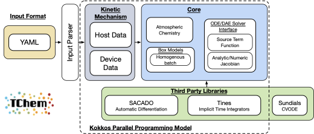

# **Overview**

Tchem-atm is a chemistry solver for problems in atmospheric chemistry.
TChem-atm computes source terms and Jacobian matrices for chemical systems. It is a performance-portable software toolkit designed for complex kinetic mechanisms.

Software Design:

  * Modern C++.
  * [Kokkos](https://github.com/kokkos/kokkos.git) programming model for performance portability.
  * CMake build system.
  * Numerical and SACADO analytic Jacobian calculations for all models.
  * Coupling to external ODE solvers, e.g., [Tines](https://github.com/sandialabs/Tines), [Sundials](https://computing.llnl.gov/projects/sundials) (CVODE).



TChem-atm is configured using a YAML input file to construct the internal representation of the kinetic model, containing relevant parameters for the computation of chemical source terms.
It computes reaction constants and rates of progress for all reactions and calculates the net production rate, or source terms, for all chemical species.
TChem-atm automatically calculates the Jacobian matrix for source terms using either finite differences (numerical Jacobian) or automatic differentiation (analytical Jacobian via SACADO).
Furthermore, the computation of the source term and associated Jacobian is independent of the time integration solver in TChem-atm.
As such, TChem-atm provides an interface for time-stepping solutions (Box model) for the Tines and CVODE libraries.
Finally, TChem-atm features a batched interface for all of the above calculations.

# **Citations**

* [TChem: A performance portable parallel software
toolkit for complex kinetic mechanisms.](https://www.sciencedirect.com/science/article/pii/S0010465522003472)

```bibtex
@article{tchem:Kim:2022,
  title    = {{TChem: A performance portable parallel software toolkit for complex kinetic mechanisms}},
  journal  = {Computer Physics Communications},
  volume   = {285},
  pages    = {108628},
  year     = {2023},
  issn     = {0010-4655},
  author   = {Kyungjoo Kim and Oscar H. Díaz-Ibarra and Habib N. Najm and Judit Zádor and Cosmin Safta},
  keywords = {TChem, Kokkos, Performance portability, GPU, Flow chemistry}
}
```

* ["Benchmarking TChem for Potential Incorporation into E3SM as a Replacement Chemical Kinetics Solver"](sand_report/QTI_tchemV1.pdf)
```bibtex
@techreport{Diaz-Ibarra:2024:tchem,
  author      = {Diaz-Ibarra, Oscar and Schmidt, Michael J.  and Safta, Cosmin },
  title       = {{Benchmarking TChem for Potential Incorporation into E3SM as a Replacement Chemical Kinetics Solver}},
  institution = {Sandia National Laboratories},
  year        = {2024},
  number      = {SAND2024-01807R}
}
```

# **Installation**

The [installation](installation.md) guide demonstrates how to obtain, build, and install TChem-atm along with the requisite third-party libraries.

# **Theoretical Background**

TChem-atm's approach is briefly described in the [Methodology section](methodology.md).

# **Input File**

A description of the configuration file is presented in the [Input File section](input.md).

# **Examples**

A list of examples can be found [here](examples.md).

# **Acknowledgements**

TChem-atm development has been supported by the following funding sources:

* Sandia Laboratory Directed Research and Development (LDRD) projects "Bridging aerosol representations across scales with physics-constrained statistical learning" and "Benchmarking TChem for Potential Incorporation into E3SM as a Replacement Chemical Kinetics Solver."

* The [EAGLES project](https://climatemodeling.science.energy.gov/projects/enabling-aerosol-cloud-interactions-global-convection-permitting-scales-eagles), which was funded by
the Office of Science's [Biological and Environmental
Research](https://science.osti.gov/ber) Program.

* Exascale Catalytic Chemistry ([ECC](https://www.ecc-project.org/)) Project.
