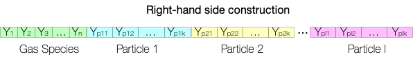

# **Methodology**

TChem-atm computes the source term or the right-hand side of the gas-species equations:

<!-- \begin{equation}\label{eq:ode_vmr} -->
$$
\newcommand{\dif}{\mathrm{d}}
\newcommand{\eee}{\mathrm{E3SM}}
  \frac{\dif{} \eta_k}{\dif{} t}=\dot{\omega}_k,\quad k = 1, \dots, N
$$
<!-- \end{equation} -->

and its associated Jacobian matrix, $\textbf{J}_{ij} = \frac{\partial \dot{\omega}_i}{\partial \eta_j }$, which is evaluated using either finite differences (Tines library) or automatic differentiation (Sacado library).
Furthermore, TChem-atm has an interface for Tines or CVODE ODE (ordinary differential equation) solver to advance the volumetric mixing ratio (vmr, $\eta_k$ ) of gas species, $k$, in time.

The net production rate of species $k$, $\dot{\omega}_k$, or the "right-hand side" of the previous equation is computed using:

<!-- \begin{equation}\label{eq:net_production_rates} -->
$$
  \dot{\omega}_k=\sum_{i=1}^{N_{\text{react}}}\nu_{ki}q_i,\quad \nu_{ki}=\nu''_{ki}-\nu'_{ki},
$$
<!-- \end{equation} -->

where $q_i$ is the rate of progress of reaction $i$, $N_{\text{react}}$ is the number of reactions and $\nu''_{ki}$ and $\nu'_{ki}$ are the stoichiometric coefficients for species $k$ in reaction $i$ for the reactant and product sides of the reaction, respectively.
The rate of progress of reaction $i$, $q_i$, is computed as

<!-- \begin{equation}\label{eq:rate_of_progress} -->
$$
  q_i={k_f}_i\prod_{j=1}^{N_{\text{spec}}}\eta_j^{\nu'_{ji}},
$$
<!-- \end{equation} -->

where $N_{\text{spec}}$ is the number of species, ${k_f}_i$ is the reaction constant of reaction $i$. The reaction constant ${k_f}_i$ can take several functional forms depending on the reaction type. We present below the reaction types that are available in TChem-atm.

<!-- Note that in $\eee{}$`s CAMPP solver, only forward reaction calculations are employed, and the single reaction constant values depend on the type of reaction. -->

## **Aerosol-Gas interations**

TChem-atm facilitates the construction of source terms (or RHS) for gas-aerosol cases. In these cases, the RHS is constructed as follows:



Where, the first part of the RHS corresponds to the concentration of gas species. Then, the concentration of each particle is appended. Currently, TChem-atm supports the [SIMPOL mass transfer](methodology.md#simpol-mass-transfer).

## **Reaction Types**

Currently, TChem-atm can reproduce gas chemistry for two complex reaction mechanisms: the gas chemistry of $\eee{}$ v3, i.e., the UCI chemistry system (University of California Irvine), and the Carbon Bond 2005 chemical mechanism, which is well-formulated for urban to remote tropospheric conditions ([Dawson](https://gmd.copernicus.org/articles/15/3663/2022/),[Yarwood](https://www.camx.com/Files/CB05_Final_Report_120805.pdf)).
To represent these mechanisms, TChem-atm implements Troe, Arrhenius, Troe-Arrhenius ratio, and Custom-H2O2 reaction types.

Next, we present the expression for the forward rate constant of the reaction types implemented in TChem-atm.
In these equations, $\mathrm{T}$, $\mathrm{P}$, and $[M]$ correspond to the temperature, pressure, and air concentration.

### Arrhenius Type

The Arrhenius type of reaction (`type: ARRHENIUS`) is computed by

$$
k_f = A \mathop{\mathrm{exp}} \left( \frac{C}{\mathrm{T}} \right)  \frac{\mathrm{T}}{D}^B (1+ E\,\mathrm{P})
$$

Where, $A$, $B$, $C$, and $D$ are kinetic constants. As an example, the following reaction from the Carbon Bond 05 mechanism,

$$
O_3 + NO \rightarrow NO_2 + O_2,
$$

has the following information provided using the following YAML configuration:

```yaml
- MUSICA_name: R3
  reactants:
    O3: 1
    NO: 1
  products:
    NO2: 1
  type: ARRHENIUS
  coefficients:
    A: 3e-12
    B: 0.0
    C: -1500.0
    D: 0.0
```

Under `reactants` and `products`, the name and stoichiometric coefficient ($\nu''_{ki}$, $\nu'_{ki}$) of each species is listed.

Note that in the previous reaction, $O_2$ is not considered a product in the computation of $k_f$.

### Troe Type

The Troe type of reaction (`type: TROE`) is computed by

$$
k_f=\frac{k_0[M]}{1+\frac{k_0[M]}{k_{\infty}}}F_c^{\left(1+\left(\frac{\log_{10} \left(\frac{k_0[M]}{k_{\infty}} \right)}{N}\right)^2 \right)^{-1}},
$$

where, $k_0$ and $k_{\infty}$ are computed via the following Arrhenius expression.

$$
k_0 = k_{0_A} \mathop{\mathrm{exp}} \left( \frac{k_{0_C}}{\mathrm{T}} \right)  \left(\frac{\mathrm{T}}{300}\right)^{k_{0_B}}
$$

$$
k_{\infty} = k_{\infty_A} \mathop{\mathrm{exp}} \left( \frac{k_{\infty_C}}{\mathrm{T}} \right) \left(\frac{\mathrm{T}}{300}\right)^{k_{\infty_B}}
$$

As an example of one reaction from the Carbon Bond 05 mechanism,

$$
O + NO_2 \rightarrow NO_3
$$

The kinetic constants are provided using the following format:

```yaml
- MUSICA_name: R5
  reactants:
    O: 1
    NO2: 1
  products:
    NO3: 1
  type: TROE
  coefficients:
    k0_A: 2.5e-31
    k0_B: -1.8
    k0_C: -0.0
    kinf_A: 2.2e-11
    kinf_B: -0.7
    kinf_C: -0.0
    Fc: 0.6
    N: 1.0
```

We use a modified version of the Troe reaction for the UCI mechanism using the `type: JPL`.

For example, for the `uci6` reaction in the UCI mechanism:

$$
HNO_3 + OH \rightarrow NO_3 + H_2O
$$

```yaml
- coefficients:
    k0_A: 6.5e-34
    k0_B: 0
    k0_C: 1335
    Fc: 1
    kinf_A: 2.7e-17
    kinf_B: 0
    kinf_C: 2199
  type: JPL
  note: uci6
  adjust_reaction:
  - M
  id: '52'
  reactants:
    HNO3: 1
    OH: 1
  products:
    NO3: 1
    H2O: 1
```
Note that in the  `JPL` type `N = 1`.

### Custom H2O2 type

The rate constant for the custom H2O2 type of reaction (`type: CMAQ_H2O2`) cannot be expressed as the combination of Arrhenius and Troe reaction types. Hence, TChem-atm has a specific convention for this reaction.

<!--$$
k_f = A_1 \mathop{\mathrm{exp}} \Big( \frac{C_1}{\mathrm{T}} \Big)
\left(\frac{\mathrm{T}}{300}\right)^{B_1} + A_2 \mathop{\mathrm{exp}} \Big ( \frac{C_2}{\mathrm{T}} \Big) \left(\frac{\mathrm{T}}{300}\right)^{B_2} \mathrm{conv}
$$-->

$$
k_f = A_1 \mathop{\mathrm{exp}} \left( \frac{C_1}{\mathrm{T}} \right)
\left(\frac{\mathrm{T}}{300}\right)^{B_1} + A_2 \mathop{\mathrm{exp}} \left( \frac{C_2}{\mathrm{T}} \right) \left(\frac{\mathrm{T}}{300}\right)^{B_2} V_A
$$

<!--mjs: I don't have an intuition for what the "conv" term is, but if my late-night math is correct, it appears to have units [Pa / J], which is... volume?? Either way, I thought it should have a single-letter variable name, which probably shouldn't be V if it's not a volume-->

$$
V_A = \frac{P\ N_A\ R \times 10^{12}}{T},
$$

<!--where, $V_A = \frac{N_A}{R \times 10^{-12}} \frac{P}{T}$ and-->
$N_A=6.02214179 \times 10^{23}$ is Avogadro's number ($\mathrm{mole}^{-1}$), and $R=8.314472$ is the universal gas constant ($J\ \mathrm{mole}^{-1}\ K^{-1}$).

As an example of this reaction from the Carbon Bond 05 mechanism:

$$
2HO_2 \rightarrow H_2O_2
$$

<!--
**Note: from here, onward, the equations and variable names don't agree, so I would make sure to provide a map between the corresponding quantities.**
-->

```yaml
- MUSICA_name: R34
  reactants:
    HO2: 2
  products:
    H2O2: 1
    DUMMY: 1
  type: CMAQ_H2O2
  coefficients:
    k1_A: 2.3e-13
    k1_C: 600.0
    k2_A: 1.7e-33
    k2_C: 1000.0
```
### Custom OH_HNO3

The Carbon Bond 05 mechanism employs this reaction type and can be expressed as the sum of Arrhenius and Troe reaction types, i.e., $k_f=k_{\text{troe}} + k_{\text{arrhenius}}$. Hence, one must specify two reactions in the YAML input files. For example:

$$
HNO_3 + OH \rightarrow NO_3
$$

```yaml
- coefficients:
    A: 2.4e-14
    C: 460.0
  note: CMAQ_OH_HNO3
  products:
    NO3: 1.0
  reactants:
    HNO3: 1.0
    OH: 1.0
  type: ARRHENIUS
- coefficients:
    k0_A: 6.5e-34
    k0_C: 1335.0
    kinf_A: 2.7e-17
    kinf_C: 2199.0
    Fc : 1
  note: CMAQ_OH_HNO3
  products:
    NO3: 1.0
  reactants:
    HNO3: 1.0
    OH: 1.0
  type: TROE
```

### Troe-Arrhenius Ratio Type

This reaction type (`type: R_JPL_ARRHENIUS`) is computed as the ratio between Troe (or JPL) and Arrhenius types, i.e., $k_f=k_{\text{troe}}/k_{\text{arrhenius}}$.

The addition of this reaction type to represent UCI reactions required custom-defined rate coefficients (UCI #7-9). As an example, for the [`uci7`](https://github.com/E3SM-Project/scream/blob/a73d48a5f8556e5240b64b037bc60d42cb5f2413/components/eam/src/chemistry/mozart/llnl_O1D_to_2OH_adj.F90#L184) reaction:

$$
HO_2NO_2 + M \rightarrow HO_2 + NO_2 + M
$$

```yaml
- coefficients:
    k0_A: 1.9e-31
    k0_B: -3.4
    Fc: 0.6
    kinf_A: 4e-12
    kinf_B: -0.3
    A: 2.1e-27
    B: 0
    C: 10900.0
  type: R_JPL_ARRHENIUS
  note: uci7
  adjust_reaction:
  - M
  id: '57'
  reactants:
    HO2NO2: 1
    M: 1
  products:
    HO2: 1
    NO2: 1
    M: 1
```

### usr_DMS_OH

The reaction type `usr_DMS_OH` is part of the UCI mechanism and is hard-coded in the [`mo_usrrxt`](https://github.com/E3SM-Project/scream/blob/a73d48a5f8556e5240b64b037bc60d42cb5f2413/components/eam/src/chemistry/mozart/mo_usrrxt.F90#L683) submodule in $\eee$'s code. In TChem, we reformulate this reaction type as a Troe (or JPL) reaction type using the following configuration.

```yaml
- coefficients:
    k0_A: 3.57e-43
    k0_B: 0
    k0_C: 7810
    Fc: 1
    kinf_A: 3.0909090909090913e-12
    kinf_B: 0
    kinf_C: 350
  type: JPL
  note: usr_DMS_OH
  adjust_reaction: [M, M]
  id: '89'
  reactants:
    DMS: 1
    OH: 1
  products:
    SO2: 0.5
    HO2: 0.5
```

### usr_SO2_OH

The reaction type `usr_SO2_OH` is part of the UCI mechanism and is hard-coded in the [`mo_usrrxt`](https://github.com/E3SM-Project/scream/blob/a73d48a5f8556e5240b64b037bc60d42cb5f2413/components/eam/src/chemistry/mozart/mo_usrrxt.F90#L693) submodule in $\eee$'s code. In TChem, we reformulate this reaction type as a Troe (or JPL) reaction type using the following configuration.

```yaml
- coefficients:
    k0_A: 3e-31
    k0_B: -3.3
    k0_C: 0
    Fc: 0.6
    N: 1.0
    kinf_A: 1.5e-12
    kinf_B: 0
    kinf_C: 0
  type: JPL
  note: usr_SO2_OH
  adjust_reaction: [M, M]
  id: '90'
  reactants:
    SO2: 1
    OH: 1
  products:
    H2SO4: 1
```

### Modifier prod O1D

Reaction types [UCI 1, 2, 3](https://github.com/E3SM-Project/scream/blob/a73d48a5f8556e5240b64b037bc60d42cb5f2413/components/eam/src/chemistry/mozart/llnl_O1D_to_2OH_adj.F90#L152) in the UCI mechanism require a modifier to compute the reaction rate. We did not include this modifier under the `reaction` section of the input file; instead, we created the section `modifier_prod_O1D`.

$$
\mathrm{factor} = \frac{\mathrm{prod_{O1D}}}{f_c}
$$

<!-- this equation looks weird to me with all the full words--can "factor" and "prod" be given single-letter variable names? -->

where, $f_c$

$$
f_c = A_1 \mathop{\mathrm{exp}} \left(\frac{C_1}{\mathrm{T}} \right) [\mathrm{N_2}] +
A_2 \mathop{\mathrm{exp}} \left(\frac{C_2}{\mathrm{T}} \right) [\mathrm{O_2}] +
A_3 \mathop{\mathrm{exp}} \left(\frac{C_3}{\mathrm{T}} \right) [\mathrm{H_2O}]
$$

The YAML configuration for this modifier is :

```yaml
modifier_prod_O1D:
  coefficients:
    A1: 2.15e-11
    C1: 110.0
    A2: 3.3e-11
    C2: 55.0
    A3: 1.63e-10
    C3: 60.0
  species_name_1: N2
  species_name_2: O2
  species_name_3: H2O
  reaction_list:
  - 22
  - 23
  - 24
  photolysis_reaction_index: 0
```
Here, under `coefficients`, the kinetic parameters are presented.
The species involved in this factor are listed as `species_name_1` and `species_name_2`.
Note that TChem will find the index of the proper corresponding species.
The `reaction_list` gives the index of the reactions for which this modifier is applied. Finally, `photolysis_reaction_index` is the index of the $\mathrm{prod_{O1D}}$ reaction.

Future work will convert `reaction_list` from a list of indices to reaction IDs, as will `photolysis_reaction_index`. Thus, one does not need to know the index of each reaction before running a TChem simulation.

## **Gas-Aerosol Reaction Types**

### SIMPOL mass transfer

It calculates the evaporation rate of organic species that partition between the gas and aerosol phase, based on the parameterization by [Pankow and Asher (2008)](https://acp.copernicus.org/articles/8/2773/2008/acp-8-2773-2008.html).

TChem-atm utilizes a YAML file and follows to the [CAMP format](https://github.com/open-atmos/camp) to specify SIMPOL types.

<!--Future work-->
<!-- ## Gas and Particle interaction

### Simple mass transfer -->
